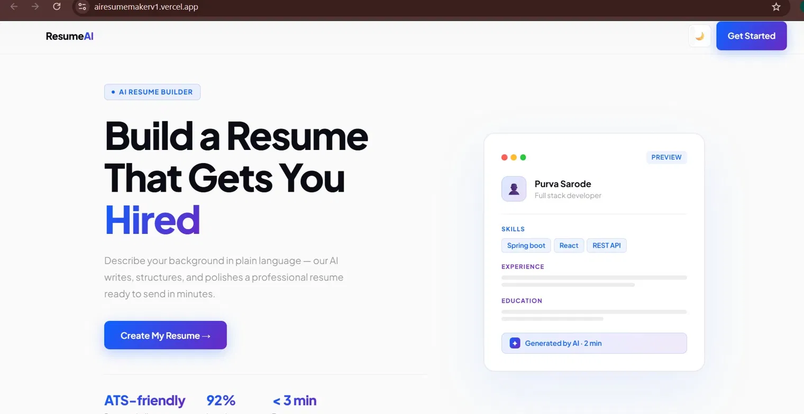
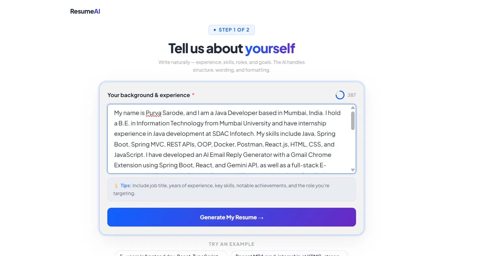
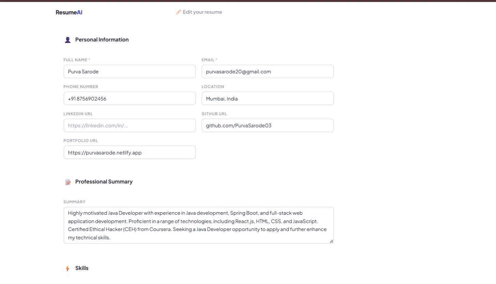
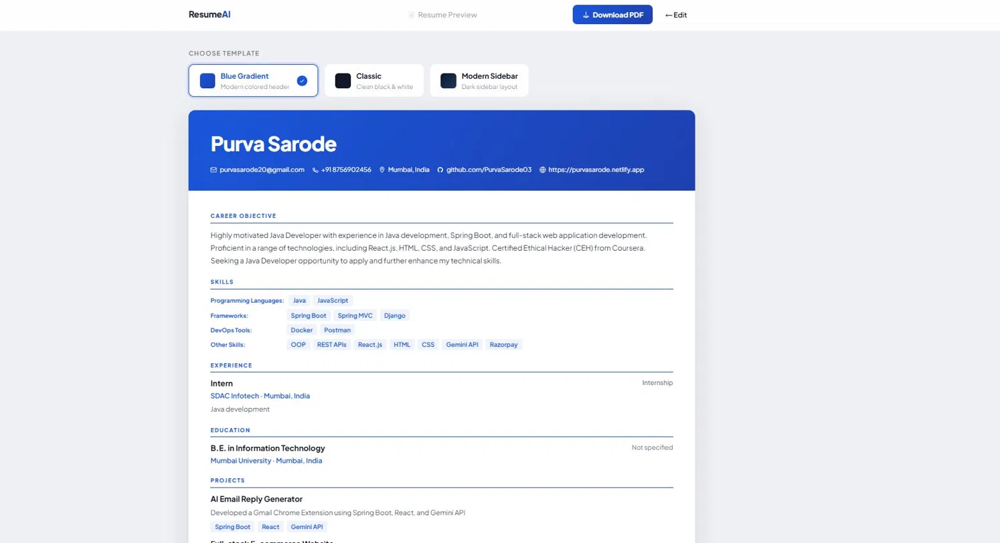

<div align="center">

# 🚀 ResumeAI — Build a Resume That Gets You Hired

[](https://airesumemakerv1.vercel.app)
[](https://spring.io/projects/spring-boot)
[](https://reactjs.org/)
[](https://groq.com/)

**Describe yourself in plain language — AI writes, structures, and polishes your resume in under 3 minutes.**



</div>

---

## ✨ Features

- 🧠 **AI-Powered Generation** — Just describe your background; Groq AI handles formatting & wording
- 📄 **ATS-Friendly Output** — Optimized for Applicant Tracking Systems
- ⚡ **Fast** — Resume generated in under 3 minutes
- 🎨 **Multiple Templates** — Blue Gradient, Classic, and Modern Sidebar
- 📥 **PDF Export** — Download your polished resume instantly
- ✏️ **Editable Fields** — Fine-tune every section after generation
- 🌙 **Dark Mode** — Easy on the eyes

---

## 🎬 Demo Video

> 📽️ **https://drive.google.com/file/d/1Ydr5giMc6rj7NtbenTCoRF_tNccA5pYv/view?t=10.432** ← *(Replace with your video link)*

Or see it in action:

| Step 1 — Describe Yourself | Step 2 — AI Generates | Step 3 — Preview & Download |
|:---:|:---:|:---:|
|  |  |  |

---
[](https://airesumemakerv1.vercel.app)
## 🛠️ Tech Stack

| Layer | Technology |
|-------|-----------|
| **Frontend** | React 18, daisyUI |
| **Backend** | Spring Boot , Java 24 |
| **AI Engine** | Groq API  |
| **Deployment** | Vercel (Frontend) Render(backend) |
| **PDF Export** | Browser-native / jsPDF |

---

## 📁 Project Structure

```
ResumeAI/
├── frontend/                  # React app
│   ├── src/
│   │   ├── components/        # UI components
│   │   ├── pages/             # Landing, Builder, Preview
│   │   └── App.jsx
│   └── package.json
│
├── backend/                   # Spring Boot app
│   ├── src/main/java/
│   │   ├── controller/        # REST endpoints
│   │   ├── service/           # Groq API integration
│   │   └── model/             # Resume data models
│   └── pom.xml
│
└── README.md
```

---

## 🚀 Getting Started

### Prerequisites

- Node.js 18+
- Java 17+
- Maven 3.8+
- Groq API Key → [Get one free at groq.com](https://console.groq.com/)

### 1. Clone the Repository

```bash
git clone https://github.com/PurvaSarode03/ResumeAI.git
cd ResumeAI
```

### 2. Backend Setup (Spring Boot)

```bash
cd backend
```

Create `src/main/resources/application.properties`:

```properties
groq.api.key=YOUR_GROQ_API_KEY
groq.api.url=https://api.groq.com/openai/v1/chat/completions
server.port=8080
```

Run the backend:

```bash
mvn spring-boot:run
```

### 3. Frontend Setup (React)

```bash
cd frontend
npm install
```

Create a `.env` file:

```env
REACT_APP_API_BASE_URL=http://localhost:8080
```

Start the frontend:

```bash
npm start
```

Open [http://localhost:3000](http://localhost:3000) 🎉

---

## 🔌 API Endpoints

| Method | Endpoint | Description |
|--------|----------|-------------|
| `POST` | `/api/resume/generate` | Generate resume from plain text |
| `POST` | `/api/resume/export-pdf` | Export resume as PDF |

### Sample Request

```json
POST /api/resume/generate
{
  "userInput": "My name is Purva Sarode. I am a Java Developer with experience in Spring Boot, React, and REST APIs..."
}
```

---

## 🌐 Deployment

The frontend is deployed on **Vercel**. To deploy your own:

```bash
cd frontend
npm run build
vercel --prod
```

---

## 🤝 Contributing

Contributions are welcome! Feel free to:

1. Fork the repo
2. Create a feature branch (`git checkout -b feature/amazing-feature`)
3. Commit your changes (`git commit -m 'Add amazing feature'`)
4. Push to the branch (`git push origin feature/amazing-feature`)
5. Open a Pull Request

---

## 👩‍💻 Author

**Purva Sarode**

[](https://purvasarode.netlify.app)
[](https://github.com/PurvaSarode03)
[](mailto:purvasarode20@gmail.com)

---


---

<div align="center">

⭐ **If this project helped you, please give it a star!** ⭐

Made with ❤️ by Purva Sarode

</div>
